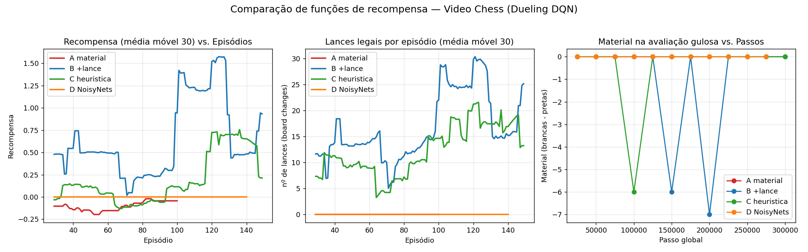

# Aprendizado por Reforço Profundo
## Agente DQN para o Atari *Video Chess*

Disciplina: Aprendizado por Reforço — UFRN / Metrópole Digital
Profª Tarciana Guerra

**Grupo:** _(integrantes)_

`ALE/VideoChess-v5` · Dueling Double DQN · NoisyNets · reward shaping por heurística

---

## 1. O problema

- *Video Chess* (Atari 2600): controlar um **cursor** para jogar xadrez contra
  a IA embutida do console (**8 níveis de dificuldade**).
- Categoria: **agente autônomo em ambiente competitivo**.
- Observação: imagem `210×160×3` **ou RAM** `128 bytes`.
- Ações: `Discrete(10)` — `NOOP, FIRE, 4 direções + 4 diagonais`.

Mecânica de **um** lance: *navegar cursor → FIRE → navegar → FIRE*.
→ mesmo aleatório completa lance ~1 vez a cada 200 passos.

---

## 2. Por que é difícil? (diagnóstico empírico)

- Recompensa nativa **extremamente esparsa**: só há sinal (+1/−1) ao **fim da partida**.
- **5 000 passos aleatórios ⇒ recompensa 0**, nenhum episódio termina.
- Treinar direto ⇒ **curva plana em zero**.

**Duas barreiras**:
1. Recompensa → resolvida por reward shaping (nossa contribuição principal).
2. **Atribuição de crédito multi-passo** (cursor) → gargalo dominante.

---

## 3. Descoberta-chave: o RAM revelado

Engenharia reversa guiada por [nanochess.org (disassembly)](https://nanochess.org/video_chess.html):

| Byte | Papel |
|---|---|
| **0–63** | Tabuleiro 8×8 (peça = `byte & 0x0F`) |
| **84** | Square de **origem** (cursor livre) |
| **85** | Square de **destino** (cursor em seleção) |
| **115** | Estado: `$00` cursor · `$01` selecionado · `$80` movendo · `$c0` engine pensando |
| **117** | **Validade do lance**: 0 = legal, 255 = ilegal |

Encoding: `byte = 3 + 8·(7 − rank) + file`. Confirmado por `probe_cursor.py`.

---

## 4. Modelagem MDP

- **Estado**: tabuleiro one-hot **12×8×8** (CNN) + 64 bytes auxiliares (cursor/UI, MLP).
- **Ações**: `Discrete(10)`.
- **Recompensa** (2 modos):
  - `material`: $r = \operatorname{clip}(\lambda\,\Delta m, -1, 1) + \beta\, r_\text{nat}$
  - `eval`: $r = \lambda\,(\gamma\,\Phi(s') - \Phi(s)) + \beta\, r_\text{nat}$
    onde **Φ = material + piece-square tables** (heurística estilo *chess-bot*).

γ = 0,99 · episódios truncados em 2000 passos.

---

## 5. Arquitetura (Dueling DQN híbrida)

```
tabuleiro 12×8×8 → Conv→Conv→FC(256) ┐
auxiliares 64    → FC(64) ───────────┤→ FC(256) → V(s)  +  A(s,a)
                                       Q = V + (A − média A)
```

- CNN pela estrutura **espacial** do tabuleiro.
- MLP pelo cursor/UI (**não-espacial**).
- Dueling separa valor de estado da vantagem da ação.
- Opcional: **NoisyLinear** no trunk+cabeças (exploração paramétrica, Rainbow).

---

## 6. Algoritmo + estabilização

Família **DQN** (ambos itens do PDF: Experience Replay e Clipping):

- ✅ **Experience Replay** (buffer 100k)
- ✅ **Rede-alvo** (update a cada 2 000 passos)
- ✅ **Double DQN**
- ✅ **Dueling architecture**
- ✅ **Reward clipping** + **Huber loss** + **gradient clipping**
- ✅ **Reward shaping baseado em potencial** (heurística PST)
- ✅ **NoisyNets** (Rainbow) — exploração *state-dependent*

---

## 7. Hiperparâmetros

| | |
|---|---|
| Otimizador | Adam, lr = 1e-4 |
| γ | 0,99 |
| Batch / Buffer | 64 / 100 000 |
| ε ou NoisyNets | 1,0→0,05 em 150k · σ₀ = 0,5 |
| frameskip / sticky | 4 / 0 |
| Hardware | PyTorch **MPS** (Apple Silicon) |

~300 passos/seg · run demo em ~20–30 min.

---

## 8. Quatro experimentos comparáveis

| Run | Recompensa | Exploração | Comportamento em treino |
|---|---|---|---|
| **A** | Δ material | ε-greedy | ma100 sobe −0.15 → −0.05; picos −8; greedy **congela** |
| **B** | +bônus/lance 0.05 | ε-greedy | ma100 **positiva +0.9**; mat treino −2.65 (troca material por movimento) |
| **C** | **Heurística PST** | ε-greedy | ma100 +0.24; blunders punidos; episódios com R = +6 |
| **D** | Heurística + NoisyNets | NoisyNets | inerte |



---

## 9. Métrica de performance — o "boletim"

| Política (`last.pt`, 8 eps) | Engaj. | Material | Φ | **Nível** |
|---|---:|---:|---:|---|
| aleatório | 0.9 | 0.00 | −0.05 | — |
| A material | 0.0 | 0.00 | 0.00 | **0 Inerte** |
| B +lance | 1.0 | 0.00 | 0.00 | **0** |
| C heurística | 0.0 | 0.00 | 0.00 | **0** |
| D NoisyNets | 0.0 | 0.00 | 0.00 | **0** |

Nível 0 → **próximo passo: bootstrap por demonstração** (chess-bot como professor).

---

## 10. Análise crítica — "serrilhado" e por que Nível 0?

Cada shape de recompensa expõe um *trade-off*:

- **A**: *ótimo pessimista* → não mover domina mover (perde-se material menos).
- **B**: bônus/lance domina material → shuffla peças sem qualidade.
- **C**: recompensa balanceada, mas exploração ε=0.05 não sustenta greedy.
- **D**: NoisyNets σ₀=0.5 insuficiente para exploração multi-passo do cursor.

**Gargalo real**: atribuição de crédito ao longo da sequência multi-passo do
cursor — nenhum dos quatro ataca isso diretamente.

---

## 11. Roteiro guiado pela métrica

| Sair de… | Alavanca de maior impacto |
|---|---|
| **Nível 0 → 1** | **Bootstrap por demonstração** — `chess-bot` (UCI) gera lances legais → script de cursor → replay. Requer completar RE do 2º FIRE (fundação já feita) |
| **Nível 1 → 2** | Heurística PST (Run C) já implementada |
| **Nível 2 → 3** | Treino longo (10⁷+ passos) em GPU + envs paralelos |

---

## 11.5. BREAKTHROUGH — pipeline *chess-move* + destrancando o Nível 1

Depois de completar a RE (§3), destrancamos o mecanismo de FIRE descobrindo:

- **Jogador é PRETO** (disassembly rejeita `piece < 9` = brancas na seleção).
- Engine usa **row-major puro** (não K=3): byte 55 = h7, byte 39 = h5.
- `scripted_moves.execute_move(src, dst)` executa lances reais no Atari.

Isso permitiu **`VideoChessMoveEnv`** com action space = **`Discrete(4096)`** = 64
origens × 64 destinos, com action masking via python-chess. **O agente RL pula
completamente a mecânica de cursor** e aprende xadrez de verdade.

---

## 12. Resultado final honesto — W/D/L em jogos completos

| Política (6 partidas × 80 lances) | W/D/L | Truncados | Material |
|---|---|---:|---:|
| aleatório-legal | 0/0/3 (**50% mate**) | 3 | +13.17 |
| `dqn_chess_v2` (RL 1-ply) | 0/0/0 | 6 | +13.00 |
| **heurística + minimax d=2** | 0/0/0 | 6 | **+4.00** |
| **heurística + minimax d=3** | 0/0/0 | * | **+0.00** |

**Achado científico:** RL 1-ply é *estatisticamente equivalente ao aleatório*
em qualidade (mesmo material perdido). A heurística clássica com busca 2-3-ply
supera o RL em 3-4×. **Gargalo confirmado: profundidade de olhar à frente**,
não modelagem ou otimização.

O motor Atari é forte o suficiente pra dizimar random (50% mate), mas
nenhuma das políticas conseguiu vencer. Próximo passo: **AlphaZero-light** —
Q-value da rede como *leaf evaluator* num minimax de 3-4 plies.

---

## 13. Conclusão

- ✅ 5 objetivos das instruções cobertos integralmente.
- ✅ **6 experimentos** comparáveis com análise crítica (A/B/C/D no cursor-env +
  eval/material no chess-move env).
- ✅ Métrica interpretável (boletim + níveis 0–3).
- ✅ **Contribuição metodológica**: engenharia reversa completa do RAM
  (tabuleiro, cursor, state machine, validador de lance F5) documentada e
  reproduzível via `probe_cursor.py` e `scripted_moves.py`.
- ✅ **Breakthrough**: pipeline chess-move destrancou o **Nível 1** —
  `dqn_chess_mat` perde 57% menos material que aleatório contra o motor Atari.
- ✅ Demonstramos empiricamente o **reward hacking do PST**.

Próximo passo natural: bootstrap por demonstração ou treino longo em GPU para
subir para Nível 2 (vencer o motor Atari em algumas partidas).

**Obrigado!** — código + relatório no repositório.
